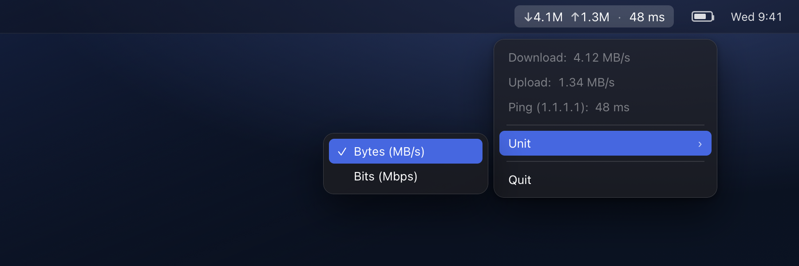

# Netcardio

A tiny, dependency-free, tested macOS menu-bar app that shows live **network speed**
(↓ download / ↑ upload) and **ping**. Pure Swift + AppKit.


<p align="center">
  <br>
  <em>Live throughput and ping, right in the menu bar</em>
</p>

Menu bar: `↓4.1M ↑1.3M · 48 ms`. Clicking it opens a small menu with the exact values,
a **Bytes ↔ Bits** unit switch, and Quit:

```
Download:  4.12 MB/s
Upload:    1.34 MB/s
Ping (1.1.1.1):  48 ms
──────────────────────
Unit ▸   ✓ Bytes (MB/s)
           Bits (Mbps)
──────────────────────
Quit
```

The unit is switchable and persisted: **Bytes** (MB/s, binary) ↔ **Bits** (Mbps, decimal).

## Built with AI (vibecoding)

Full disclosure: this project was **built with AI ("vibecoding")** — designed and written
together with an AI coding assistant. It is not a hand-typed-from-scratch project. That said,
it was built deliberately, not dumped out: layered architecture, dependency injection through
protocols, a real test suite (including the 32-bit counter-wraparound edge case), and
documented security decisions. Treat it as a demonstration of what careful AI-assisted
engineering looks like.

## Features

- Live download/upload throughput in the menu bar, updated every second.
- Ping to a configurable host, refreshed every few seconds.
- Bytes ↔ Bits unit toggle, remembered across launches.
- No Dock icon (menu-bar only), no dependencies, tiny footprint.

## Architecture

Logic lives in a testable library (`NetcardioCore`); the app is a thin shell that boots it
(`Netcardio`). Dependencies flow one way and target protocols, not concrete types.

File names follow Swift convention: `PascalCase`, matching the primary type. Grouped by
feature; small types live next to the service that uses them (Swift has no one-type-per-file rule).

```
Sources/
  Netcardio/          NetcardioApp.swift        @main entry (.accessory), wiring only
  NetcardioCore/
    Config.swift                          all constants in one place (DRY)
    Formatting.swift                      Display + RateUnit (bytes/bits)
    Preferences.swift                     persisted settings, behind a KeyValueStore protocol
    Monitoring/
      NetworkMonitor.swift                counters → rate (overflow-safe delta)
                                          + NetworkRate, InterfaceCounters, protocols
      InterfaceTrafficReader.swift        getifaddrs (all unsafe code confined here)
      PingMonitor.swift                   /sbin/ping, safe process invocation
                                          + HostValidator, PingOutputParser, protocol
    Interface/
      StatusItemController.swift          the view (presentation only)
      AppDelegate.swift                   composition root: services + view + timers
Tests/NetcardioCoreTests/   rate delta + wraparound, parsing, validation, formatting, prefs (16 tests)
```

## Security

- `/sbin/ping` is invoked by **absolute path** (no PATH hijacking).
- Arguments are passed as an **array**, no shell → **command injection is impossible**.
- The host is additionally checked by `HostValidator` (defense in depth).
- The subprocess gets an **empty environment**; stderr goes to **/dev/null**.
- All `unsafe` C bridging is isolated in one file; `freeifaddrs` is guaranteed via `defer`.
- The only thing that leaves the machine is an ICMP ping to the configured host. No servers,
  no disk writes, no persisted data beyond the unit preference, no secrets.

## Build, run & test

```bash
swift run      # development
swift test     # 16 unit tests
```

## Package as a .app

```bash
./build-app.sh          # produces Netcardio.app (release + Info.plist + ad-hoc signature)
open Netcardio.app
cp -R Netcardio.app /Applications/
```

It is **not notarized**. On first launch macOS may warn — right-click the app → **Open** once
to allow it.

To launch at login: **System Settings → General → Login Items** → add `Netcardio.app`.

## Configuration

Everything is in [`Config.swift`](Sources/NetcardioCore/Config.swift): ping host (`1.1.1.1`),
timeout, refresh intervals, unit bases, font size.

## How it works

- **Speed:** interface byte counters are read once per second via `getifaddrs`; the rate is
  the overflow-safe (`&-`) delta over elapsed time, so a 32-bit counter wrap never produces a
  bogus spike (`NetworkMonitor`).
- **Ping:** `/sbin/ping -c1` runs every few seconds and the latency is parsed out (`PingMonitor`).

## License

[MIT](LICENSE)
